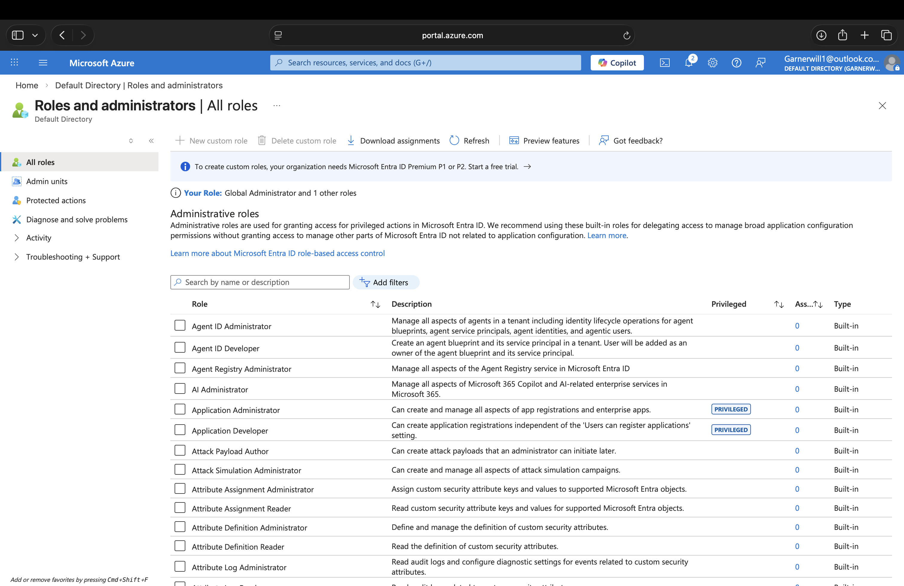
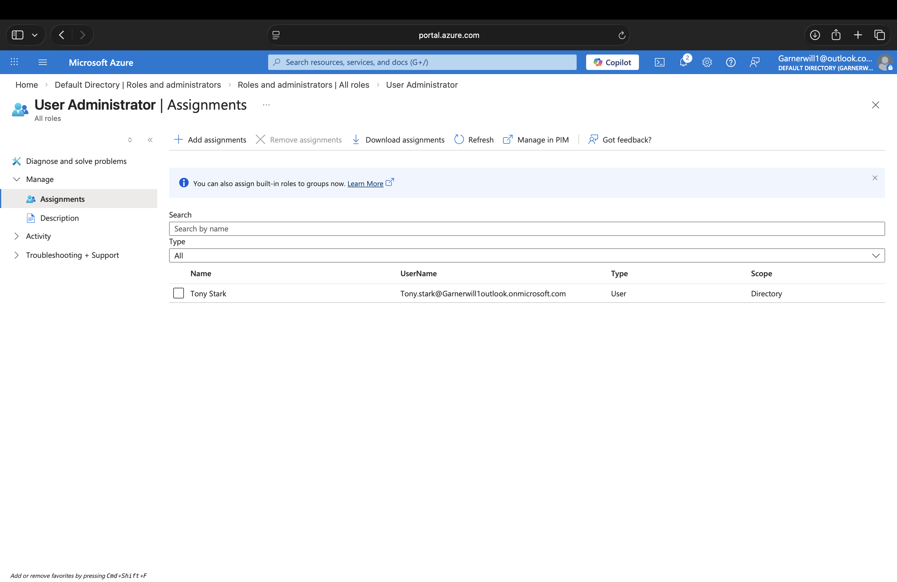
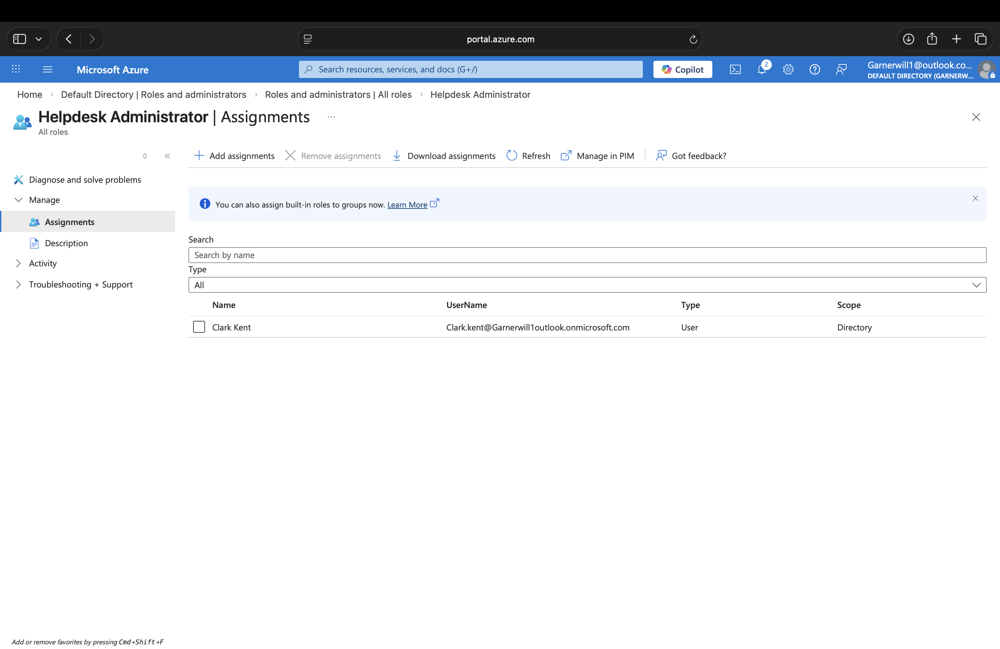
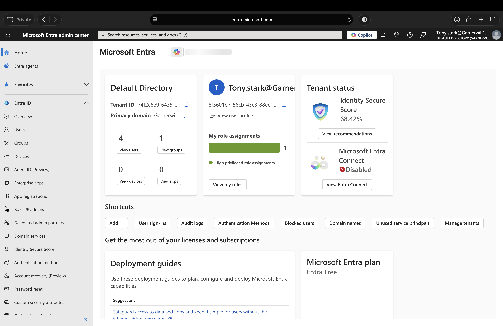
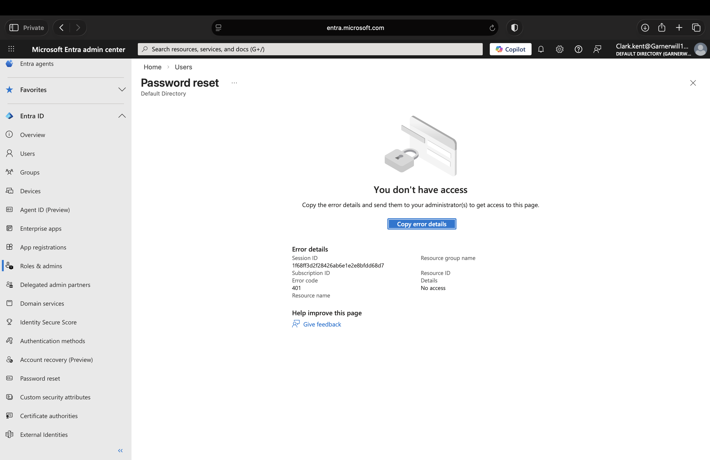
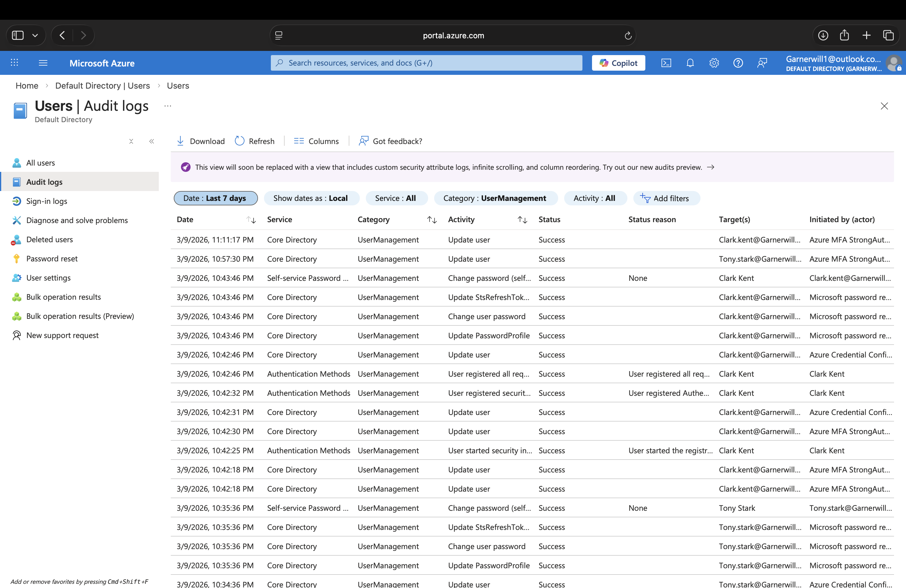

# Microsoft Entra RBAC Lab

## Overview
This project is a beginner Microsoft Entra role-based access control (RBAC) home lab built to practice administrative role assignments and validate effective access in Microsoft Entra ID.

## Objectives
- Assign built-in administrative roles to test users
- Validate role assignments in Microsoft Entra ID
- Compare portal access across role-assigned accounts
- Observe permission boundaries for specific admin actions
- Review audit logs for role assignment activity

## Lab Environment
- Microsoft Entra ID
- Microsoft Entra admin center
- GitHub for documentation

## Users and Roles
- Tony Stark — User Administrator
- Clark Kent — Helpdesk Administrator
- Peter Parker — standard user (no admin role)

## Tasks Performed
1. Opened Microsoft Entra Roles and administrators
2. Assigned the **User Administrator** role to Tony Stark
3. Assigned the **Helpdesk Administrator** role to Clark Kent
4. Signed in with the role-assigned accounts in separate private browser sessions
5. Tested access to Users, Groups, Roles & admins, and Password reset
6. Reviewed audit logs to validate role assignment activity

## Results
- Successfully assigned built-in Microsoft Entra administrative roles
- Verified that both Tony Stark and Clark Kent could access key Entra admin areas such as Users, Groups, and Roles & admins
- Observed that the Password reset blade remained restricted in the tested portal experience
- Demonstrated that effective access depends on both role assignment and the exact admin action or interface being used

## Skills Demonstrated
- Microsoft Entra ID
- Role-Based Access Control (RBAC)
- Administrative role assignment
- Least privilege
- Access validation
- Audit log review
- Identity and Access Management (IAM)

## Screenshots

### 1. Roles and Administrators

### 2. User Administrator Assignment

### 3. Helpdesk Administrator Assignment

### 4. Tony Stark Admin Access

### 5. Clark Kent Admin Access

### 6. Password Reset Access Restriction

### 7. Audit Logs

## What I Learned
This lab helped me understand how Microsoft Entra RBAC works in practice. I learned how to assign built-in administrative roles, test role-based access using separate accounts, and validate that effective permissions can vary depending on the exact portal blade or action being used.

## Resume Bullet
Built a Microsoft Entra RBAC home lab by assigning built-in administrative roles to test users, validating access to core admin areas, and reviewing permission boundaries and audit activity to understand least-privilege role behavior.
